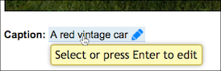

One of the key principles that Infusion components operate on is configurability. Components have
options that can be set by integrators to customize the behaviour. For example, the Infusion
[Inline Edit](http://build.fluidproject.org/infusion/demos/inlineEdit/) component has
options for configuring the text content of the tooltip, the length of time the user must hover
before the tooltip appears, the 'invitation text' that should be displayed in the field if it is empty, and other things.



Developers who are integrating an Inline Edit into their web application can use these options to
customize the Inline Edit for their particular needs.

A component creator will typically define default values for as many of the component's options as
possible, so that the component will work "out of the box," without customization. This is done with
a call to [fluid.defaults](https://github.com/fluid-project/infusion/blob/infusion-1.5/src/framework/core/js/Fluid.js#L1519-L1539), which registers the component's defaults with the Framework.

When a component is instantiated, the first thing that the Framework does is merge any
integrator-provided customizations with the component's defaults, before the initialization of the
component proceeds. The Framework follows specific procedures for this merging process, and these
procedures can be specified by the component creator, if they have a need for a different merging
process than the default ones. (Further reading: [Options Merging](OptionsMerging.md))

## Specialized Options ##

Naturally, each component will have its own custom options, such as the tooltip text for the
Inline Edit. However, the Framework supports certain fixed options that are expected for certain
component types (for information about the different component types, see
[Component Grades](ComponentGrades.md)). These options have fixed names that the Framework expects
to see, so component developers must use these names, and not override them for other purposes.

For example, view components work with the DOM, displaying values and manipulating the interface in
response to user inputs and actions. In order to do this, the components need to have access to the
relevant DOM elements. The Framework supports a `selectors` option for this. The `selectors` option 
contains a list of named selectors that identify the DOM elements a component will work with.
Considering again the example of the Inline Edit component, the component has a button that users
can activate to switch from view mode into edit mode, so the "selectors" option contains a selector
named `textEditButton`:
```javascript
fluid.defaults("inlineEdit", {
    selectors: {
        textEditButton: ".flc-inlineEdit-textEditButton",
        ...
    },
    ...
});
```

(Further reading on special options: [Component Configuration Options](ComponentConfigurationOptions.md))

## Subcomponents ##

In addition to simple configurations, a components defaults are used to identify its subcomponents, 
as described in [Understanding Infusion Components](UnderstandingInfusionComponents.md).