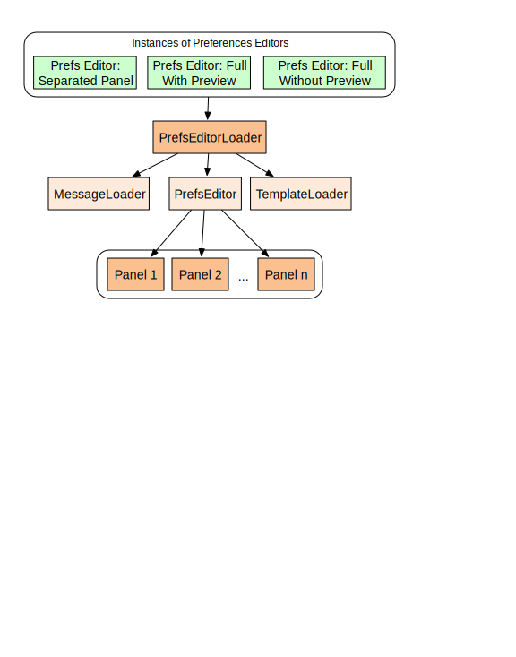

Localization in the Preferences Framework makes use of message bundles: JSON files containing the strings that are to be used in the interface.

## Message Bundles


Message bundles are JSON files containing key/value pairs representing the message key and the localized text associated with it. Each set of localized text should be contained in its own message bundle.

```javascript
{
    "slidingPanelShowText": "+ Show Display Preferences",
    "slidingPanelHideText": "- Hide"
}
```

Message bundles cannot contain arrays. Instead a namespace should be used to group message keys together. This will require extra processing when using the messages. (See [Using Message Bundles](#using-message-bundles) below)

<div class="infusion-docs-note"><strong>Note:</strong> The namespace should <strong>not</strong> include ".", which is used for path parsing.</div>

```javascript
{
    "contrast-default": "Default",
    "contrast-bw": "Black on white",
    "contrast-wb": "White on black",
    "contrast-by": "Black on yellow",
    "contrast-yb": "Yellow on black",
    "contrast-lgdg": "Low contrast",
    "contrastLabel": "Colour & Contrast"
}
```

## Preferences Editor Component Hierarchy

Understanding how to access message bundles is helped by understanding the general structure of the components of a preferences editor.

 

### PrefsEditorLoader

All versions of preferences editors (separated panel, full page with preview and full page without preview) are instances of a "PrefsEditorLoader" component. The PrefsEditorLoader coordinates the work of its three subcomponents: MessageLoader, TemplateLoader and PrefsEditor.

### MessageLoader

The messageLoader is the fluid.prefs.resourceLoader responsible for retrieving all of the message bundles added to the Prefs Editor (See [Adding Message Bundles](#adding-message-bundles) below). Message bundles are automatically distributed to the Prefs Editor and Panels based on the configuration supplied in the [auxiliary schema](AuxiliarySchemaForPreferencesFramework.md). However, to access the message bundle from other components on the IoC tree, the IoC reference `{messageLoader}.resources.<messageBundle>.resourceText` can be used. Additionally the `defaultLocale` and `locale` options are used to specify which localization to fetch for each bundle. (See: [Specifying a localization](#specifying-a-localization) below)

### PrefsEditor

PrefsEditor is the host component that holds all the actual panel (or adjuster) components as subcomponents. By default, the message bundle is **not** passed down to PrefsEditor. If your PrefsEditor component will need direct access to the message bundle, provide a 'fluid.messageResolver' subcomponent at instantiation, as shown in the following example:

```javascript
components: {
    msgResolver: {
        type: "fluid.messageResolver",
        options: {
            messageBase: "{messageLoader}.resources.prefsEditor.resourceText"
        }
    }
}
```

### Panels

The message bundle is attached to each panel component as the `messageBase` option. The `messageBase` is passed to the panel's `msgResolver` subcomponent and used for message lookup operations.

## Adding Message Bundles

Message bundles can be specified through the [auxiliary schema](AuxiliarySchemaForPreferencesFramework.md). The Preferences Framework will load all of the Message Bundles and automatically distribute them to the panels.

### Example Auxiliary Schema

```javascript
{
    "namespace": "fluid.prefs.constructed",
    "terms": {
        "templatePrefix": "../../../framework/preferences/html/",
        "messagePrefix": "../../../framework/preferences/messages/"
    },
    "template": "%templatePrefix/SeparatedPanelPrefsEditor.html",
    "message": "%messagePrefix/prefsEditor.json", // message bundle for the preference editor itself
    "textSize": {
        "type": "fluid.prefs.textSize",
        "enactor": {
            "type": "fluid.prefs.enactor.textSize"
        },
        "panel": {
            "type": "fluid.prefs.panels.textSize",
            "container": ".flc-prefs-text-size",
            "template": "%templatePrefix/PrefsEditorTemplate-textSize.html",
            "message": "%messagePrefix/textSize.json" // message bundle for the fluid.prefs.panels.textSize component
        }
    },
    "lineSpace": {
        "type": "fluid.prefs.lineSpace",
        "enactor": {
            "type": "fluid.prefs.enactor.lineSpace",
            "fontSizeMap": {
                "xx-small": "9px",
                "x-small": "11px",
                "small": "13px",
                "medium": "15px",
                "large": "18px",
                "x-large": "23px",
                "xx-large": "30px"
            }
        },
        "panel": {
            "type": "fluid.prefs.panels.lineSpace",
            "container": ".flc-prefs-line-space",
            "template": "%templatePrefix/PrefsEditorTemplate-lineSpace.html",
            "message": "%messagePrefix/lineSpace.json" // message bundle for the fluid.prefs.panels.lineSpace component
        }
    }
}
```

## Using Message Bundles

### In the ProtoTrees

Strings from the Message Bundles are rendered into the templates through the protoTrees, using the `messagekey`, the name of the string in the bundle:

<table>
    <thead>
        <tr>
            <th>Example use in a ProtoTree</th>
            <th>JSON message bundle</th>
        </tr>
    </thead>
    <tbody>
        <tr>
            <td valign="baseline"><pre><code>fluid.defaults("fluid.prefs.panels.linksControls", {
    ...
    protoTree: {
        label: {messagekey: "linksLabel"},
        linksChoiceLabel: {messagekey: "linksChoiceLabel"},
        inputsChoiceLabel: {messagekey: "inputsChoiceLabel"},
        links: "${links}",
        inputsLarger: "${inputsLarger}"
    }
});</code></pre></td>
            <td valign="baseline"><pre><code>{
    "linksLabel": "Links &amp; buttons",
    "linksChoiceLabel": "Underline and bold",
    "inputsChoiceLabel": "Enlarge buttons, menus, text-fields, and other inputs"
}</code></pre></td>
        </tr>
    </tbody>
</table>

### IoC References

Message Bundles can also be resolved directly through an [IoC reference](IoCReferences.md) making use of the `msgLookup` property, which is automatically created for any panel component. This process is quite similar to how IoC references to selectors are resolved.

```javascript
fluid.defaults("fluid.slidingPanel", {
    ...
    strings: {
        showText: "{that}.msgLookup.slidingPanelShowText",
        hideText: "{that}.msgLookup.slidingPanelHideText"
    }
    ...
});
```

There are other, more complex cases where an array of strings is required (for example, for a set of radio buttons or a drop-down). In these cases, a `stringArrayIndex` in the components options needs to be specified. This defines both

1. which strings to include and
2. the order in which they should be returned.

It is accessed the same way that an individual string is referenced, except that reference should point to the key in the `stringArrayIndex` instead of a single string name. In the example below, the `stringArrayIndex` is used to define the `theme` string bundle, and the `theme` string bundle is referenced within the `protoTree.expander.tree` ('`optionnames: "${{that}.msgLookup.theme}"`'):

```javascript
    fluid.defaults("fluid.prefs.panel.contrast", {
    ...
    stringArrayIndex: {
        theme: ["contrast-default", "contrast-bw", "contrast-wb", "contrast-by", "contrast-yb", "contrast-lgdg"]
    },
    protoTree: {
        label: {messagekey: "contrastLabel"},
        expander: {
            type: "fluid.renderer.selection.inputs",
            rowID: "themeRow",
            labelID: "themeLabel",
            inputID: "themeInput",
            selectID: "theme-radio",
            tree: {
                optionnames: "${{that}.msgLookup.theme}", // IoC reference to the array of strings
                optionlist: "${{that}.options.controlValues.theme}",
                selection: "${value}"
            }
        }
    }
    ...
});
```

### Direct Access

The strings can also be accessed directly, outside of the context of IoC references or renderer protoTrees (for example, in an invoker function), by making function calls to the internal string bundle `lookup()` method.

```javascript
that.msgLookup.lookup(value); // where value is either the string name or the key in the stringArrayIndex to lookup.
```

## Specifying a Localization

The messageLoader takes `defaultLocale` and `locale` options for specifying which localized message bundle to fetch. The `locale` option specifies the localization desired. By default it is sourced from the prefsEditorLoader's settings object, `"{prefsEditorLoader}.settings.locale"`. The `defaultLocale` provides a fallback to use if the desired localization cannot be located. By default it is sourced from the prefsEditorLoader's `defaultLocale` option.

### Fallback Rules

If a requested localization cannot be found, the messageLoader will attempt to find another message bundle to satisfy the request. Language codes are expected in a form similar to BCP 47 tags but with a "\_" instead of a "-" separating the language code from the country code.

Assuming the Canadian French message bundle is requested:
1. look for a message bundle corresponding to the language code specified by the `locale` option (e.g. "fr_CA")
2. look for a message bundle with the same language as the language code specified by the `locale` option (e.g. "fr")
3. look for a message bundle corresponding to the language code specified by the `defaultLocale` option (e.g. "en_US")
4. look for a message bundle with the same language as the language code specified by the `defaultLocale` option (e.g. "en")
5. look for a message bundle with the exact URL as specified through the auxiliary schema or directly to the messageLoader (e.g. "message/prefsEditor.json")

### Bundle Naming

The message bundles should conform to the following naming convention to facilitate discovery by the messageResolver:
`<bundle name>_<language code>_<country code>.json`

The following are all valid message bundle names and will work with the above [Fallback Rules](#fallback-rules):

- prefsEditor_fr_CA.json
- prefsEditor_fr.json
- prefsEditor.json
