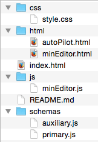
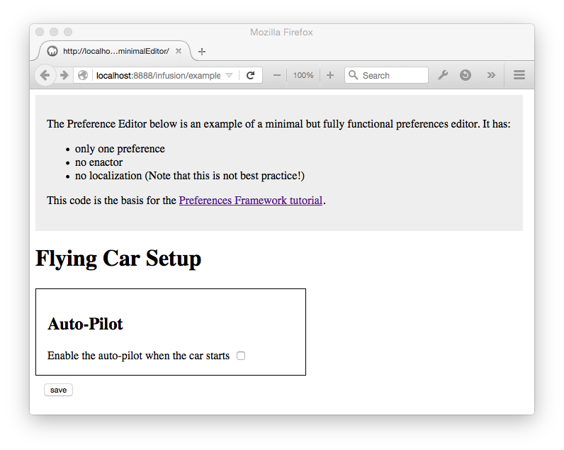
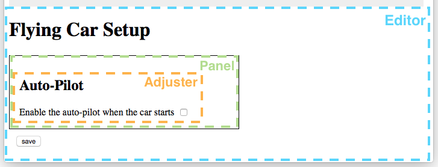

This tutorial will walk you through the process of building a preference editor using the
Infusion [Preferences Framework](../PreferencesFramework.md).

## Introduction ##
We’ll start by looking at a functional – but very simple – preference editor and explaining how it
works. From there, we’ll learn about more features of the Preferences Framework by adding functionality to the editor.

Throughout this tutorial, you’ll find links into the documentation for various parts of
Infusion and the Preferences Framework. You shouldn’t need to visit these links to
follow the tutorial; they’re there in case you’re interested in reading more about something.

### Example code ###
The source code used in this tutorial is one of the examples provided in the Infusion code base,
which you can download from github: https://github.com/fluid-project/infusion. You’ll find the code
for the simple preference editor in the examples folder:
https://github.com/fluid-project/infusion/tree/master/examples/framework/preferences/minimalEditor.
We recommend you download the Infusion library and load the example code into your favourite editor.
<figure>

<figcaption>Figure 1: Folder hierarchy for the preference editor example</figcaption>
</figure>

The example code is a preference editor for the world’s first flying car.
If you run a local webserver
(for example using [this approach](http://www.linuxjournal.com/content/tech-tip-really-simple-http-server-python),
or using [MAMP](https://www.mamp.info/en/))
and navigate to the `index.html` file in a browser, you should see this interface:
<figure>

<figcaption>Figure 2: The screen of the example preference editor</figcaption>
</figure>

This preference editor has only one preference – a simple boolean setting for the car’s auto-pilot
feature – and a ‘save’ button. Try it out: If you check the checkbox and click save, the state of
the preference will be stored in a cookie, and when you reload the page, the checkbox will be set
to the saved value. Go ahead, try it.

Let’s talk about what we’re seeing in this interface:
<figure>

<figcaption>Figure 3: The parts of a preference editor screen</figcaption>
</figure>

* This editor is a full-page editor, so all of what you see is Preferences Editor
(the outer, blue dashed line).
* The content inside the rectangle (outlined with a green dashed line) is called a Panel –
a container representing one (or more) preferences. This particular Editor has only one Panel,
but a realistic editor will likely have several. This tutorial will teach you what you need to
know to add more panels to this editor.
* Inside the Panel is an Adjuster (outlined by the inner-most, orange dashed line) – the controls
for adjusting a particular preference. This Panel has only one Adjuster in it, but you might want
to create a panel that has multiple adjusters, say, in the case of very closely-related preferences.
This tutorial will teach you about creating Panels with multiple Adjusters.

Let’s take a close look at the code.

#### Primary Schema ####
The [Primary Schema](../PrimarySchemaForPreferencesFramework.md) is a document that defines the preferences for the editor.
The Primary Schema for our example editor is defined in the
`schemas/primary.js` file using the JSON format
(you can learn about JSON at http://json.org/):

```javascript
/**
 * Primary Schema
 * This schema defines the preference(s) edited by this preference editor:
 * their names, types, default values, etc.
 */
fluid.defaults("minEditor.primarySchema", {

    // the base grade for the schema;
    // using this grade tells the framework that this is a primary schema
    gradeNames: ["fluid.prefs.schemas"],

    schema: {
        // the actual specification of the preference
        "minEditor.autoPilot": {
            "type": "boolean",
            "default": false
        }
    }
});
```
<div class="infusion-docs-callout">
`fluid.defaults()` is one of the core functions in Infusion: It is used to create [components](../UnderstandingInfusionComponents.md)
(the building blocks of any Infusion application) and register them with the Framework.
</div>

In this code snippet, the Primary Schema is created using a call to the
Infusion Framework function `fluid.defaults().`

`fluid.defaults()` accepts two arguments:
1. a string name, and
2. a JavaScript object containing [options for configuring](../ComponentConfigurationOptions.md) the component.

In the code snippet above, the first argument – the name – is `“minEditor.primarySchema”`.
The second argument – the options – is an object containing (in this case) two properties:
`gradeNames` and `schema`:

<dl>
<dt>`gradeNames`</dt>
<dd>
<div class="infusion-docs-callout">
A **grade** is _very loosely_ analogous to a class, in that using a grade in the definition of a
component infers the properties of that grade to the component. It’s actually a bit more complex
than that; later, you’ll probably want to read the documentation about [Component Grades](../ComponentGrades.md).
This tutorial will explain more about grades as it goes along.
</div>
Any call to `fluid.defaults()` must include the `gradeNames` property in the options argument.
This property defines the base _[grade](../ComponentGrades.md)_ for the component.

In a Primary Schema, the `gradeNames` property must include the grade `“fluid.prefs.schemas”`,
which is defined by the Preferences Framework. **Using this particular grade is what registers
this component as a Primary Schema with the Framework.** The Framework will automatically record
this fact and use this Primary Schema with your preference editor.
</dd>
<dt>`schema`</dt>
<dd>
This property is the JSON definition of the preferences for this preference editor.

In this particular example, only a single preference is being defined; a boolean called
“minEditor.autoPilot”. This name of the preference is the key in the JSON definition;
the value for this key is an object containing the properties of this preference:

<pre class="highlight">
<code class="hljs javascript">"minEditor.autoPilot": {
    "type": "boolean",
    "default": false
}</code></pre>

Every preference in a primary schema must have at least two properties: `“type”` and `“default”`.

_Coming soon: More information about these two properties_
</dd>
</dl>

#### Panel ####

<div class="infusion-docs-callout">
[Models](../FrameworkConcepts.md#model-objects) are central to Infusion, which,
while not formally a [Model-View-Controller framework](../FrameworkConcepts.md#mvc),
embodies the the separation of concerns that is central to MVC.
Most Infusion components have an internal model, for maintaining the state of the component.
</div>

A [Panel](../Panels.md) is a component responsible for rendering the user interface controls for a
preference and tying them to the internal [model](../FrameworkConcepts.md#model-objects) that represents the preference value.
The Panel for the auto-pilot preference control is defined in the `minEditor.js` file:

```javascript
/**
 * Panel for the auto-pilot preference
 */
fluid.defaults("minEditor.panels.autoPilot", {
    gradeNames: ["fluid.prefs.panel"],

    // the Preference Map maps the information in the primary schema to this panel
    preferenceMap: {
        // the key must match the name of the pref in the primary schema
        "minEditor.autoPilot": {
            // this key is the path into the panel's model where this preference is stored
            "model.autoPilot": "default"
        }
    },

    // selectors identify elements in the DOM that need to be accessed by the code;
    // in this case, the Renderer will render data into these particular elements
    selectors: {
        autoPilot: ".mec-autoPilot"
    },

    // the ProtoTree is basically instructions to the Renderer
    // the keys in the prototree match the selectors above
    protoTree: {
        // this value is an IoC reference to the last part of the model path in the preferenceMap
        autoPilot: "${autoPilot}"
    }
});
```
In this code snippet, the Panel is created using a call to the Infusion Framework function
`fluid.defaults()`, just as the Primary Schema was. As with the Primary Schema, the call to
`fluid.defaults()` is passed two arguments: 1) a string name (`"minEditor.panels.autoPilot"`), and
2) a JavaScript object containing options for configuring the component – in this case, the panel.

The screenshot in Figure 2 (above) shows what the panel looks like to the user: A single checkbox
with a label, with a header above. The options for configuring this panel
include four properties: `gradeNames`, `preferenceMap`, `selectors` and `prototree`:
<dl>
<dt>`gradeNames`</dt>
<dd>As we saw with the Primary Schema, any call to `fluid.defaults()` must include the `gradeNames`
property in the options argument. Panels must use the `"fluid.prefs.panel"` grade.
Using this grade automatically buys you a lot of Framework supports necessary for Panels.</dd>
<dt>`preferenceMap`</dt>
<dd>A Panel must have a _preference map_, which maps the information in the Primary Schema
into your Panel. Let’s look at this one more closely:
<pre class="highlight">
<code class="hljs javascript">{
preferenceMap: {
    "minEditor.autoPilot": {
        "model.autoPilot": "default"
    }
},</code></pre>

The first line of the preference map, `“minEditor.autoPilot”`, is the name of the preference.
This exactly matches the name we saw in the Primary Schema earlier. This the value for this
key is a JavaScript object that defines how this particular preference relates to the Panel’s
internal data model.

The content of this preference map is a key/value pair:
<ul>
<li> The key, `“model.autoPilot”`, is an [EL path](../FrameworkConcepts.md#el-paths) into the
Panel’s data model. An “EL path” is just a
dot-separated path built from names. In this case, it means “the `autoPilot`
property of the `model` property” of the panel.</li>
<li> The value, `“default”`, is a reference to the name of the `“default”` property in the Primary Schema.</li>
</ul>
This preference map is saying two things:
<ol>
<li>The preference called `“minEditor.autoPilot”` should be stored in the Panel’s model
in a property called `autoPilot`, and</li>
<li>the initial value for the property should be taken from the `“default”` property
of the Primary Schema.</li>
</ul>
</dd>
<dt>`selectors`</dt>
<dd>A Panel is a _[view component](../tutorial-gettingStartedWithInfusion/ViewComponents.md)_
– a type of Infusion component that has a _view_, that is,
a user interface. In order to maintain a separation between the code and the HTML for the view,
the code interacts with the HTML through named [selectors](../ComponentConfigurationOptions.md#-selectors-): The code only references the name, and
a Framework feature called the DOM Binder looks up the relevant DOM node for the name based
on the information in this `selectors` option.

Let’s look at this more closely:
<pre class="highlight">
<code class="hljs javascript">selectors: {
    autoPilot: ".mec-autoPilot"
},</code></pre>

The content of a `selectors` property is a set of key/value pairs. The key is the ‘name’ of the
selector and the value is the selector itself. This property has only one selector,
named `autoPilot`. The value is the CSS selector `".mec-autoPilot"`.
This selector references the actual checkbox in the template for the Panel.
This template is found in the `html/autoPilot.html` file, which looks like this:

<pre class="highlight">
<code class="hljs html">&lt;section class="me-panel"&gt;
    &lt;h2&gt;Auto-Pilot&lt;/h2&gt;

    &lt;label for="minEditor-autoPilot"&gt;Enable the auto-pilot when the car starts&lt;/label&gt;
    &lt;input type="checkbox" id="minEditor-autoPilot" class="mec-autoPilot"/&gt;
&lt;/section&gt;</code></pre>

You can see the `“mec-autoPilot”` class name on the `<input>` element.
</dd>
<dt>`prototree`</dt>
<dd>
A Panel is also a _[renderer component](../RendererComponents.md)_ – a type of Infusion component that uses the
Infusion [Renderer](../Renderer.md) to render the view based on data in the component’s model.
The _[prototree](../RendererComponentTrees.md)_ is the instructions for how the data in the component’s model maps to the template.
Let’s look at this more closely:
<pre class="highlight">
<code class="hljs javascript">protoTree: {
    autoPilot: "${autoPilot}"
}</code></pre>

A prototree contains key/value pairs, where
* the key is a selector _name_ specified in the `selectors` option, and
* the value is the specification for what to render into the DOM node referenced by the selector.

Here, the one key `autoPilot` refers to the selector named autoPilot
i.e. the reference to the checkbox in the HTML template.
The value is an _[IoC reference](../IoCReferences.md)_ to the autoPilot property of Panel’s data model.
In the Infusion Framework, an _IoC reference_ (IoC stands for Inversion of Control) is a reference
to an object in the current context using a particular syntax – specifically, the form `{context-name}.some.path.segments`.
_Coming soon: More information about IoC references._
</dd>
</dl>

#### Auxiliary Schema ####
The [Auxiliary Schema](../AuxiliarySchemaForPreferencesFramework.md) is a document that specifies
all the things needed to actually build the preference editor.
The Auxiliary Schema for our example editor
is defined in the `schemas/auxiliary.js` file:

```javascript
fluid.defaults("minEditor.auxSchema", {
    gradeNames: ["fluid.prefs.auxSchema"],
    auxiliarySchema: {
          // some code not shown
    }
});
```
Again, we use `fluid.defaults()` to create the schema.
As with the Primary Schema and the Panel, `fluid.defaults()` is passed two arguments:
1) a string name (`"minEditor.auxSchema"`), and 2) a JavaScript object containing configuration options.

Let’s look at the schema in detail.

##### Loader Grade #####
The _loader grade_ specifies the _type_ of preference editor:

```javascript
    loaderGrades: ["fluid.prefs.fullNoPreview"],
```

The Preference Framework provides three pre-defined types of editor:
1. separated panel (the default): This is a page-width panel collapsed at the top of the page;
it slides down when activated by the user.
2. full page, no preview: This is a preference editor that occupies the full page.
3. full page, with preview: This is a preference editor that occupies the full page, but includes
provisions for an iframe in the page to preview any changes made by the editor.

In the code snippet above, the `loaderGrades` option is used to specify the “full page, no preview” form.

##### Templates #####
The Auxiliary Schema must declare where to find the main HTML template for the preference editor.
In our example, this template is located in the same folder as other HTML templates.
The Auxiliary Schema allows you to define `terms` – strings that can be re-used elsewhere in the
schema. Here, it is being used to define once the path to where the HTML templates are:

```javascript
    terms: {
        templatePrefix: "html"
    },
```

The template property specifies the main HTML template for the entire preference editor:

```javascript
    template: "%templatePrefix/minEditor.html",
```
You can see the full text of this file, `minEditor.html`, in the github repo:
https://github.com/fluid-project/infusion/tree/master/examples/framework/preferences/minimalEditor/html/minEditor.html
The main thing to note in the template is the placeholder for the panel,
in this example a `<div>` with the class `mec-autoPilot”`:

```html
<!-- placeholder for the auto-pilot preference panel -->
<div class="mec-autoPilot"></div>
```

The Framework will insert the constructed Panel into this div.

##### Preferences #####
The next thing in the auxiliary schema is the configuration for the auto-pilot preference:

```javascript
autoPilot: {
    // this 'type' must match the name of the pref in the primary schema
    type: "minEditor.autoPilot",

    panel: {
        // this 'type' must match the name of the panel grade created for this pref
        type: "minEditor.panels.autoPilot",

        // selector indicating where, in the main template, to place this panel
        container: ".mec-autoPilot",

        // the template for this panel
        template: "%templatePrefix/autoPilot.html"
    }
}
```

(The name of the property, `autoPilot`, can actually be anything, but it’s helpful to use the name
of the preference.)

In our example, the auto-pilot preference configuration includes two things:
1. the type of the preference, and
2. information about the panel.

The value of the `type` property is the name of the preference as defined in the Primary Schema.

The value of the `panel` property is a JavaScript object containing configuration information
for the panel. Let’s look at each of the properties:
<dl>
<dt>`type`</dt>
<dd>This is the name of the panel that was defined in the call to `fluid.defaults()` above.</dd>
<dt>`container`</dt>
<dd>This is a CSS-based selector referencing the panel’s placeholder element in the main HTML
template – the one referenced by the `template` property above.</dd>
<dt>`template`</dt>
<dd>This is the path and filename of the HTML template for this panel.
Note, in this example, how the `templatePrefix` term is being used.</dd>
</dl>

#### Instantiation ####
The last thing in the `js/minEditor.js` file is a call to the Preferences Framework
function `fluid.prefs.create()`. This function actually creates the preference editor.
It accepts two arguments:
1. a CSS selector indicating the container element for the preference editor, and
2. a JavaScript object containing configuration information for the preference editor.

```javascript
minEditor.init = function (container) {
    return fluid.prefs.create(container, {
        build: {
            gradeNames: ["minEditor.auxSchema"]
        }
    });
};
```
This function is invoked in the main HTML file for the preference editor, `index.html`.
You can see the entire file here:
https://github.com/fluid-project/infusion/tree/master/examples/framework/preferences/minimalEditor/index.html.
Let’s look at this invocation:

```
<div id="myMinEditor"></div>

<script type="text/javascript">
    minEditor.init("#myMinEditor");
</script>
```

In the HTML snippet above, the `<div>` is the container that the preference editor will be
rendered inside of. The call to `minEditor.init()` is passed the ID of the element,
`“#myMinEditor”`, as the container argument.

In the code snippet above, the first argument – `container` – is the CSS identifier passed in to
the function. The second argument – the options – is an object containing (in this case) one
property: `build`. This option is a JavaScript object containing information that will be passed
to the Builder, a key part of the Preferences Framework.
The Builder is the core component responsible for actually building the preference editor based
on all of the configuration information for the preferences, the panels, etc.
For our simple preference editor, the build options contains only one property:
The grade name of our auxiliary schema:

```javascript
    build: {
        gradeNames: ["minEditor.auxSchema"]
    }
```
The auxiliary schema (plus the primary schema that was registered with the framework automatically)
contains all the information the Builder needs to construct the preference editor.

## Adding another preference ##

Let’s use what we’ve learned so far to add another simple preference to the editor:
Preferred volume for the radio. This preference will be a number, and it will have a
range of possible values.

To add this preference, we’ll need to
1. define the preference,
2. create the panel, and
3. add the panel to the editor.

### Defining the preference ###

We’ll edit the Primary Schema definition in `schemas/primary.js` to add the new preference definition:

```javascript
schema: {
    "minEditor.autoPilot": {
        "type": "boolean",
        "default": false
    },
    "minEditor.radioVolume": {
        "type": "number",
        "default": "2",
        "minimum": "1",
        "maximum": "5",
        "divisibleBy": "0.5"
    }
}
```
### Creating the panel ###
#### Template and adjuster ####
We will need an HTML template for the panel. Since the preference is a range,
we’ll use a slider for the adjuster.

Create a new file in the `html` folder called `radioVolume.html` and use a structure similar
to the one already used for the auto-pilot template:

```html
<section class="me-panel">
    <h2>Radio Volume</h2>

    <label for="minEditor-radioVolume">Set the desired volume for the radio</label>
    <input type="range" id="minEditor-radioVolume" class="mec-radioVolume"/>
</section>
```
We’ve used an `<input>` with type` “range”` for the adjuster.
The template doesn’t need to set the min, max or value attributes; those are dependent on the
primary schema and will be added in by the preference editor.

#### JavaScript ####

In the `minEditor.js` file, we'll create the panel component for this preference.
As with the auto-pilot panel, we use a call to `fluid.defaults()`
and set the grade to `“fluid.prefs.panel”`:

```javascript
fluid.defaults("minEditor.panels.radioVolume", {
    gradeNames: ["fluid.prefs.panel"],
    // options will go here
});
```
As with the auto-pilot panel, we need a preference map. In addition to the default value,
we also need to map the `minimum`, `maximum` and `divisibleBy` values
from the primary schema into the component:

```javascript
fluid.defaults("minEditor.panels.radioVolume", {
    gradeNames: ["fluid.prefs.panel"],

    preferenceMap: {
        "minEditor.radioVolume": {
            "model.radioVolume": "default",
            "range.min": "minimum",
            "range.max": "maximum",
            "range.step": "divisibleBy"
        }
    },
    range: {
        min: 1,
        max: 10,
        step: 1
    },

    // more will go here
});
```
The `default` property of the primary schema is mapped to `model.radioVolume`, but the `minimum`,
`maximum` and `divisibleBy` are not likely to change over the life of the component, so it’s not
really appropriate to store them in the model. Instead, we create a `range` property as a
component option. We define default values for the minimum, maximum and step, but
the Framework will override these values using the content of the Primary Schema, as specified by
the preference map.

As we saw with the auto-pilot panel, we need to declare a named selector to identify the HTML
element where the preference value will be bound:

```javascript
fluid.defaults("minEditor.panels.radioVolume", {
    gradeNames: ["fluid.prefs.panel"],

    preferenceMap: {
        "minEditor.radioVolume": {
            "model.radioVolume": "default",
            "range.min": "minimum",
            "range.max": "maximum",
            "range.step": "divisibleBy"
        }
    },

    range: {
        min: 1,
        max: 10,
        step: 1
    },

    selectors: {
        radioVolume: ".mec-radioVolume"
    },

    // more will go here

});
```

Finally, we need to define the Renderer prototree – the instructions for rendering
the model value into the template:

The
```javascript
fluid.defaults("minEditor.panels.radioVolume", {
    gradeNames: ["fluid.prefs.panel"],

    preferenceMap: {
        "minEditor.radioVolume": {
            "model.radioVolume": "default",
            "range.min": "minimum",
            "range.max": "maximum",
            "range.step": "divisibleBy"
        }
    },

    range: {
        min: 1,
        max: 10,
        step: 1
    },

    selectors: {
        radioVolume: ".mec-radioVolume"
    },

    protoTree: {
        radioVolume: {
          value: "${radioVolume}",
          decorators: [{
              type: "attrs",
              attributes: {
                  min: "{that}.options.range.min",
                  max: "{that}.options.range.max",
                  step: "{that}.options.range.step"
              }
          }]
        }
    }
});
```

This prototree is a little bit more complicated than what we used for the auto-pilot preference.
That prototree needed to do only one thing: bind the model value to the input element.
For the range input, we still need to bind the model value, but we also need to set the min, max
and step attributes of the same element. For this, a simple key/value pair isn’t enough.

<div class="infusion-docs-callout">
[Renderer Decorators](../RendererDecorators.md) allow users of the Renderer to attach various things,
such as functions, class names, etc., to the components at render time.
</div>

This prototree uses the `attrs` _[Renderer Decorator](../RendererDecorators.md)_ to add the min,
max and step to the element as attributes.

### Adding the panel to the editor ###

We saw above that the main HTML template for the tool, has a placeholder in it for
the auto-pilot panel. We will add another placeholder for the radio volume panel
to the `html/minEditor.html` file:

```html
<!-- placeholder for the auto-pilot preference panel -->
<div class="mec-autoPilot"></div>

<!-- placeholder for the radio volume preference panel -->
<div class="radioVolume"></div>
```
We’ll also need a property in the auxiliary schema, in `schemas/auxiliary.js`,  to provide the
configuration options specific to the new panel:

```javascript
radioVolume: {
    type: "minEditor.radioVolume",
    panel: {
        type: "minEditor.panels.radioVolume",
        container: ".mec-radioVolume",
        template: "%templatePrefix/radioVolume.html"
    }
}
```

## Coming Soon: ##
Information about
* Enactors
* More complicated panels
* Localization
* Design consideration
* Persistence
* Case studies