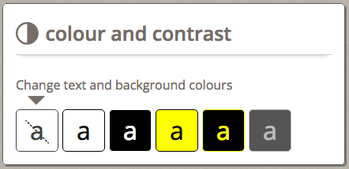
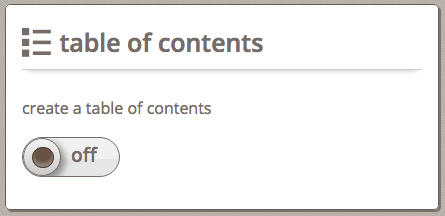

In the Infusion [Preference Framework](../PreferencesFramework.md), an "adjuster" is a single control for adjusting a particular preference. Common types of adjusters include checkboxes, radio buttons and sliders.

This tutorial describes how to create the user interface for an adjuster.

## Decide what type of control it is

Based on the nature of the setting, different types of controls will be appropriate:

* checkboxes for on/off settings
* drop-down select boxes for choices
* radio buttons for choices where you want to present all choices visually
* sliders for choosing from a range of values

Some examples:

| Preference | Possible HTML element |
|------------|-----------------------|
|text size|text input, slider |
|foreground colour|select (drop-down), radio button|
|show captions|checkbox |
|language|select (drop-down)|

## Create HTML to display the adjusters

Once you know which type of HTML element you will be rendering, create an HTML template that will be used to render it. This will include the actual control as well as any labels, etc.

For a control involving repeated data (e.g. a drop-down or radio buttons), your HTML template should include only one of the elements, along with its label, etc. The markup that is to be repeated multiple times should be enclosed in a single containing element such as a `<div>` or `<span>`.

Some Examples

<table>
    <thead>
        <tr>
            <th>HTML element</th>
            <th>Sample Markup</th>
        </tr>
    </thead>
    <tbody>
        <tr>
            <td>drop-down</td>
            <td>
                <pre><code>
&lt;label for="magnifier-position"&gt;&lt;/label&gt;
&lt;select id="magnifier-position"&gt;&lt;/select&gt;
                </code></pre>
            </td>
        </tr>
        <tr>
            <td>checkbox</td>
            <td>
                <pre><code>
&lt;input type="checkbox" id="media-choice"/&gt;
&lt;label for="media-choice"&gt;&lt;/label&gt;
                </code></pre>
            </td>
        </tr>
        <tr>
            <td>radio button</td>
            <td>
                <pre><code>
&lt;div&gt;
    &lt;input type="radio" name="theme" id="bw" value="bw" /&gt;
    &lt;label for="bw"&gt;&lt;/label&gt;
&lt;/div&gt;
                </code></pre>
            </td>
        </tr>
    </tbody>
</table>

## Add selector classes to any element that will be rendered

Each element that will have to be rendered based on the data will need a 'selector class' to allow the code to identify and manipulate it. This includes the control elements themselves as well as any labels, any elements that will have unique style classes added by the code, etc.

We recommend using different class names for selector classes and styling classes. This results in markup that may look a but redundent, but it ensures that there are no accidental errors resulting in changes to the way styling happens, etc.

[Class Name Conventions](../ClassNameConventions.md)

Some Examples

<table>
    <thead>
        <tr>
            <th>HTML element</th>
            <th>Sample Markup</th>
        </tr>
    </thead>
    <tbody>
        <tr>
            <td>drop-down</td>
            <td>
                <pre><code>
&lt;label class="flc-prefsEditor-magPositionLabel" for="magnifier-position"&gt;&lt;/label&gt;
&lt;select class="flc-prefsEditor-magPositionInput" id="magnifier-position"&gt;&lt;/select&gt;
                </code></pre>
            </td>
        </tr>
        <tr>
            <td>checkbox</td>
            <td>
                <pre><code>
&lt;input class="flc-prefsEditor-captionsInput" type="checkbox" id="captions-choice"/&gt;
&lt;label class="flc-prefsEditor-captionsLabel" for="captions-choice"&gt;&lt;/label&gt;
                </code></pre>
            </td>
        </tr>
        <tr>
            <td>radio button</td>
            <td>
                <pre><code>
&lt;div class="flc-prefsEditor-themeRow"&gt;
    &lt;input class="flc-prefsEditor-themeInput" type="radio" name="theme" id="bw" value="bw" /&gt;
    &lt;label class="flc-prefsEditor-themeLabel" for="bw"&gt;&lt;/label&gt;
&lt;/div&gt;
                </code></pre>
            </td>
        </tr>
    </tbody>
</table>

## Custom Styling

If the adjuster will be styled to look different than a traditional HTML form element, you will have to create special HTML and CSS to achieve the look you desire.

If the control or its label(s) will include graphics, we recommend using an icon font for the graphics. Icon fonts will automatically adjust to the size and colours specified by the page or by a user's personal settings, without the need for additional CSS.

[How to Create and Use Font Icons](../tutorial-iconFonts/HowToCreateAndUseFontIcons.md)

The CSS required will, of course, be dependent on the design. Some examples from existing interfaces are provided below, as inspiration.

### Example 1: A radio button styled colour and contrast panel

#### UI and MARKUP



```html
<h2>
    <span class="fl-icon-contrast"></span>
    <span class="flc-prefsEditor-contrast-label fl-heading-text"></span>
</h2>
<p class="flc-prefsEditor-contrast-descr"></p>

<div class="flc-prefsEditor-themeRow fl-choice">
    <input type="radio" class="flc-prefsEditor-themeInput fl-hidden-accessible" name="theme" id="default" value="default" />
    <div class="fl-indicator"></div>
    <label for="default" class="flc-prefsEditor-theme-label">
        <span class="fl-preview-A"></span>
        <span class="fl-hidden-accessible"></span>
        <span class="fl-crossout"></span>
    </label>
</div>
```

#### Stylus

For the header:

```stylus
.fl-prefsEditor {
    .fl-icon-contrast {
        font-family: 'InfusionIcons' !important;
        speak: none;
        font-style: normal;
        font-weight: normal;
        font-variant: normal;
        text-transform: none;
        -webkit-font-smoothing: antialiased;
        float: left;
        margin: 0.2em 0.3em 0 0;
        font-size: 1.5em;
    }

    .fl-icon-toc:before {
        content: "\e005";
    }
}
```

For the radio buttons:

```stylus
/* Theme radio buttons */
.fl-prefsEditor {
    .fl-choice {
        display: inline;
        float: left;

        label {
            margin-right: 5px;
            border: 1px solid black;
            border-radius: 5px;
            height: 3em;
            width: 3em;
            text-align: center;
            vertical-align: middle;
            display: inline-block;
            line-height: 3em !important;
            padding: 2px;
        }
        .fl-preview-A {
            font-size: 2em;
        }

        // Pseudo content to prevent AT from reading display 'a'
        .fl-preview-A:before {
            content: "a";
        }

        input:focus ~ label {
            outline: 2px solid black;
        }
    }
}
```

### Example 2: A checkbox styled table of contents panel

#### UI and MARKUP



<div class="infusion-docs-note">
    <strong>Note:</strong>

Currently the description label must be placed before the on/off toggle to prevent spacing issues from occuring. This will be addressed with a restyling of the on/off toggle with more details at the [FLUID-5708 JIRA](https://issues.fluidproject.org/browse/FLUID-5708)
</div>

```html
<h2>
    <span class="fl-icon-toc"></span>
    <span class="flc-prefsEditor-toc-label fl-heading-text"></span>
</h2>
<div class="fl-prefsEditor-onoff">
    <input type="checkbox" id="toc-choice" class="flc-prefsEditor-toc" />
    <label for="toc-choice">
        <span class="flc-prefsEditor-toc-descr"></span>
        <span class="fl-prefsEditor-switch" data-checkboxStateOn="ON" data-checkboxStateOff="OFF">
        <span class="fl-prefsEditor-switch-inner"></span>
        </span>
    </label>
</div>
```

#### Stylus

For the switch:

```stylus
// ON/OFF Switch for checkboxes
// The container for the toggle, which is also a label for the hidden checkbox.
.fl-prefsEditor-onoff {
    .fl-prefsEditor-switch {
        border-radius: 50px;
        border: 1px solid #776D67;
        width: 5em;
        height: 2em;
        background-color: #E6E6E6;
        box-shadow: 1em 1.1em 0 0 rgba(250, 250, 250, 0.53) inset;
        overflow: hidden;
        vertical-align: middle;
        display: block;
        margin-top: 1em;
        transition-duration: 0.2s;
        transition-property: padding-left, width, background-color, margin-left;
        font-size: 1.2em;
        font-weight: 600;
    }

    // Hide input while still being screen reader accessible
    input {
        border: 0 none;
        clip: rect(0px, 0px, 0px, 0px);
        height: 1px;
        margin: -1px;
        overflow: hidden;
        padding: 0;
        position: absolute;
        width: 1px;
    }

    input:focus + label {
        outline: 2px solid black;
    }

    input:checked + label .fl-prefsEditor-switch {
        padding-left: 3em;
        width: 2em;
        background-color: #2da750;
        box-shadow: -1em 1.1em 0.1em 0 rgba(172, 216, 92, 0.63) inset;
        .fl-prefsEditor-switch-inner {
            top: -1.6em;
            left: 0.46em;
        }
    }

    // With data attributes defining the on/off text, localizing the templates is easier
    input + label {
        [data-checkboxStateOn]:before {
            content: attr(data-checkboxStateOn);
        }
        [data-checkboxStateOff]:after {
            content: attr(data-checkboxStateOff);
        }

        // The "on" portion of the toggle and the knob.
        .fl-prefsEditor-switch {
            &:before {
                color: #fff;
                border: 1px solid #776D67;
                border-radius: 50px;
                float: left;
                width: 1.9em;
                height: 1.9em; // Width and height of the knob.
                text-indent: -1.6em;
                line-height: 1.7em;
                text-shadow: 1px 1px 1px #000;
                background-color: #fff;
                box-shadow: 0.2em 0.2em 0.5em #888;
                background-image: linear-gradient(bottom, rgb(205, 204, 202) 0%, rgb(244, 244, 244) 100%);
            }

            // The "off" portion of the toggle.
            &:after {
                float: left;
                position: relative;
                top: 0.36em;
                left: 0.5em;
            }
        }
    }

    // The dark inner circle to the toggle knob.
    .fl-prefsEditor-switch-inner {
        border: 1px solid #493A30;
        border-radius: 50px;
        width: 1em;
        height: 1em;
        position: relative;
        left: -2.85em;
        top: 0.46em;
        background-color: #675243;
        box-shadow: 0 -0.2em 0.3em 0.05em rgba(250, 250, 250, 0.3) inset;
        display: inline-block;
    }
}
```
