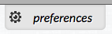
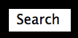

One of the goals of the high-contrast themes is to provide clarity for viewers. Shadows on text or other graphics can provide a very nice, subtle 3D effect, but this can adversely affect legibility for some people. When designing styles for high-contrast, it's important to remember to deliberately remove such shadows and other graphical effects.

## Drop Shadows

```html
<button class="idi-prefs-button">preferences</button>
```

```css
.idi-prefs-button {
    color: #000000;
    text-shadow: 1px 1px 0 #FFFFFF;
    background-color: #E5E5E5;
    background-image: url("images/preferences.png");
    background-position: 0.4em 50%;
    background-repeat: no-repeat;
    width: 8em;
}
.fl-theme-yb .idi-prefs-button {
    text-shadow: none;
    border: 1px solid yellow;
    background-image: url("images/preferences-yellow.png");
}
```

This button uses a white drop shadow on the black text to provide an elegant embossed look:



But such a shadow would be inappropriate for a high contrast theme. In this example (the yellow-on-black theme in this case), the text shadow is removed completely:


## Buttons and Other Interactive Elements

When designing high-contrast versions of these buttons, it is best to avoid gradients, 3D effects, etc. It is sometimes simplest to set a solid colour background for images. The example below shows how this can be done.

```html
<button class="search-btn">Search</button>
```

```css
.search-btn {
  background: -moz-linear-gradient(center top , #468CAA, #135876) repeat scroll 0 0 transparent;
  background: -webkit-gradient(linear, left top, left bottom, from(#468caa), to(#135876)); /* for webkit browsers */
  filter: progid:DXImageTransform.Microsoft.gradient(startColorstr='#468caa', endColorstr='#135876'); /* for IE */
  border: medium none;
  box-shadow: 1px 1px 0 #135876 inset, 1px 1px 0 #FFFFFF;
  color: #FFFFFF;
}
.fl-theme-wb .search-btn {
  background-color: #FFFFFF !important;
  border-color: #000000 !important;
  color: #000000 !important;
}
```

In this example, a button is given a nice gradient background with a two-tone border to give it a bit of a 3D effect.


The CSS for the high-contrast version (in this example, the "white-on-black") simply inverts the basic colour scheme to produce a 'button' effect, removing the gradient and forcing the background and border colours to conform to the theme colours.

