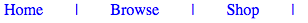
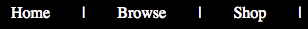
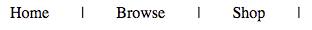
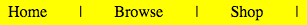
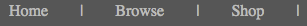

The CSS `content` property can be used to add additional content to your webpage using CSS. Often it is used to add a character, symbol, or font icon before or after some content on webpage. For example it can be used to add vertical bars to separate items on a horizontal navigation list, for example: 

```html
<nav>
  <ul class="topnav">
    <li>Home</li>
    <li>Browse</li>
    <li>Shop</li>
  </ul>
</nav>
```

```css
.topnav {
  color: #0000ff;
  list-style: none;
}

.topnav li {
  float: left;
}

.topnav li:after {
  color: #0000ff;
  content: "|";
  padding: 0 2rem;
}
```

You must specify a new colour for the high contrast themes for the content:

```css
.fl-theme-yb .topnav li:after {
  color: #FFFF00; /* yellow for yellow-on-black */
}
.fl-theme-wb .topnav li:after {
  color: #FFFFFF;  /* white for white-on-black */
}
.fl-theme-by .topnav li:after,
.fl-theme-bw .topnav li:after {
  color: #000000; /* black for black-on-yellow and black-on-white */
}
.fl-theme-lgdg .topnav li:after {
  color: #bdbdbb;  /* light grey for light grey on dark grey */
}
```

When properly styled, the `content` value will change according to the contrast theme. For example:






