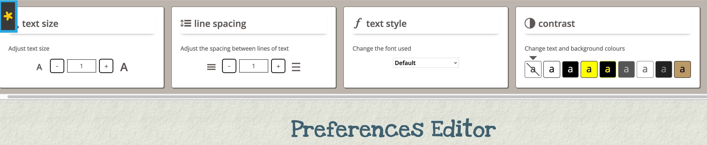
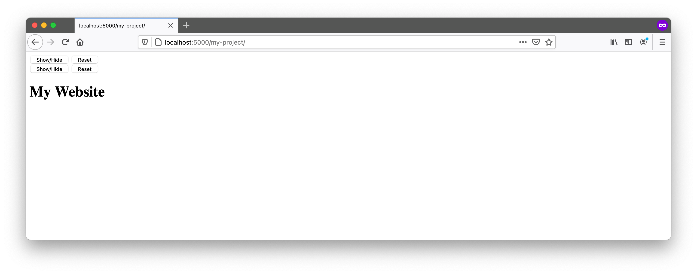
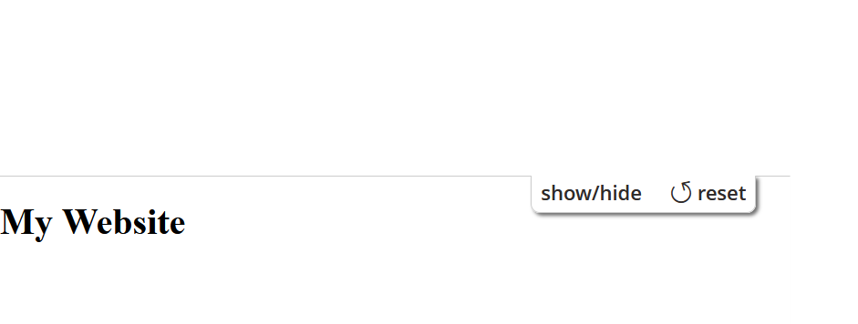
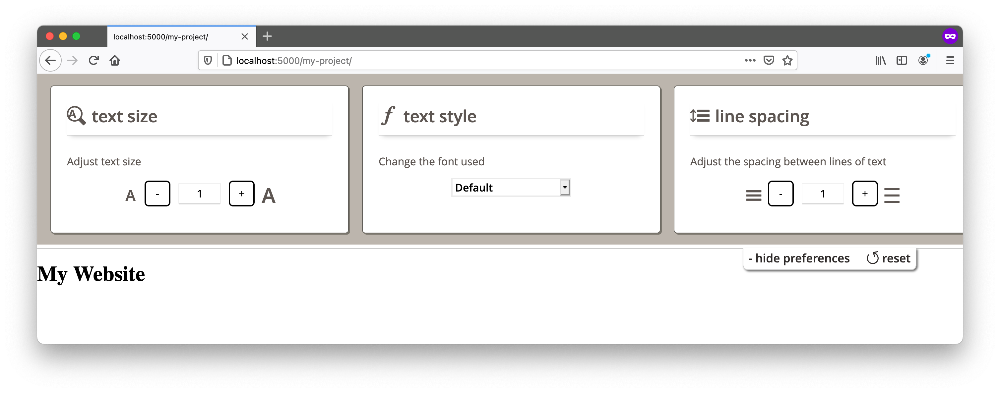

The **User Interface Options (UI Options)** component allows users to transform the presentation of the user interface and content resources so that they are personalized to the individual user's needs.

UI Options does three things:

* places a preferences editor dialog with a set of adjusters in a collapsible panel at the top of the page, accessible through a button in the upper right corner of the page;
* instantiates a cookie-based [Settings Store](../SettingsStore.md) for storing the user's preferences; and
* acts upon the user's preferences.



This tutorial assumes that:

* you are already familiar with HTML, Javascript and CSS,
* you are familiar with what the UI Options preferences editor is and does, and
* now you just want to know how to add it to your website.

## Scenario

You're putting together a website that you know will have a diverse audience. You'd like to allow your visitors to customize the presentation of the site to their individual needs, by enlarging the text or increasing the visual contrast, for example. This tutorial will show you how to add the Infusion [UI Options](http://build.fluidproject.org/infusion/demos/uiOptions/) component to your site.

These are the basic steps to add UI Options to your website:

1. [Download and install the Infusion library](#download-and-install)
2. [Prepare your page](#prepare-your-page)
    * [The Sliding Panel](#the-sliding-panel)
    * [The Table of Contents](#the-table-of-contents)
3. [Add dependencies to the page](#add-dependencies-to-the-page)
4. [Add the UI Options component](#add-the-ui-options-component)

The rest of this tutorial will explain each of these steps in detail.

## Download and install

### Download the separate UI Options library

1. [Download the UI Options library](https://github.com/fluid-project/infusion/releases/download/v2.0.0/infusion-uiOptions-2.0.0-source.zip) (there is also a [minified version UI Options](https://github.com/fluid-project/infusion/releases/download/v2.0.0/infusion-uiOptions-2.0.0-minified.zip) for deployment purposes).
2. Unzip the contents of the downloaded ZIP file to a location within your project. This will result in a new directory `infusion`.<div class="infusion-docs-note"><strong>Note:</strong> In this guide we will use the directory `my-project/lib/`.</div>
3. Your `infusion` folder will include a single file containing all of the JavaScript you need (`infusion-uiOptions.js`), HTML templates, CSS files, and other components to get UI Options to work. You will later link to these files in your HTML files.
4. Now that `infusion` is in your project directory, you can delete the `infusion-uiOptions-2.0.0.zip` (or similar name) from your download directory.

### Full Infusion library via NPM

<strong>Note: </strong>
This section assumes that you have [NPM/node.js](https://nodejs.org/en/) installed in your computer.

1. Get Infusion by typing the following in the command line (A new directory called `node_modules/infusion` will be created as a result):

   ```bash
   npm install infusion
   ```

2. Using the command line, change directory into the infusion directory that's been created within node_modules.
   * On Windows type:

     ```bash
     cd node_modules\infusion
     ```

   * On Mac type:

     ```bash
     cd node_modules/infusion
     ```

3. Now build Infusion by typing in:

   ```bash
   npm install
   grunt
   ```

4. This will create a "products" directory in the Infusion directory. Within the `project_name/node_modules/infusion/products` directory, there is now a ZIP file called "infusion-all-2.0.0.zip" (the exact filename may be a little different depending on the release of Infusion available at the time you download it).
5. Unzip this file using your preferred Unzipping program. Now move the resulting "infusion" directory to a location within your project.<div class="infusion-docs-note"><strong>Note:</strong> In this guide we will use the directory `my-project/lib/`.</div>
6. Your infusion folder will include a single file containing all of the JavaScript you need (infusion-all.js), HTML templates, CSS files, and other components to get UI Options to work. You will later link to these files in your HTML files.

## Prepare your page

### The Sliding Panel

The UI Options component includes HTML templates for all the controls, so you don't need to create any HTML for them. You only need to add a small amount of markup to the top of your webpage to tell UI Options where to render itself.

Insert the following markup at the beginning of your `<body>` tag:

```html
<body>
    <div class="flc-prefsEditor-separatedPanel fl-prefsEditor-separatedPanel">
        <!-- This is the div that will contain the Preference Editor component -->
        <div class="flc-slidingPanel-panel flc-prefsEditor-iframe"></div>
        <!-- This div is for the sliding panel that shows and hides the Preference Editor controls -->
        <div class="fl-panelBar">
            <span class="fl-prefsEditor-buttons">
                <button id="reset" class="flc-prefsEditor-reset fl-prefsEditor-reset"><span class="fl-icon-undo"></span> Reset</button>
                <button id="show-hide" class="flc-slidingPanel-toggleButton fl-prefsEditor-showHide"> Show/Hide</button>
            </span>
        </div>
    </div>

    <!-- the rest of your page here -->
    <h1>My Website</h1>
</body>
```

The main `<div>` in this snippet contains two things:

1. a `<div class="flc-slidingPanel-panel ...">` where an iframe will be inserted, containing the UI Options adjusters, and
2. a `<div class="flc-prefsEditor-separatedPanel ...">` where the sliding panel and button will be created.

The elements in this snippet all have particular class names attached to them, and it's important to keep them:

* the class names starting with `flc-` are used to identify the elements to UI Options;
* the class names starting with `fl-` are used for visual styling.

Save this file to the top directory of your project. If you open this page in your browser now, you'll only see the button in the upper left corner, since we haven't set up the CSS and UI Options isn't present on the page yet:



<div class="infusion-docs-note"><strong>Note:</strong> It doesn't matter what text you put in the button. The UI Options component will add a label and update it to reflect whether or not the panel is currently open. You can configure the text that the component uses by setting its configuration parameters. Visit <a href="../LocalizationInThePreferencesFramework.md">Localization in the Preferences Framework</a>.</div>

### The Table of Contents

One of the UI Options controls allows users to add a Table Of Contents to the top of the page. You need to add a placeholder `<nav>` to your page for the Table Of Contents. It should have a class of `"flc-toc-tocContainer"` and should appear after the `<div class="flc-prefsEditor-separatedPanel fl-prefsEditor-separatedPanel">` block:

```html
<body>
    <!-- ... -->

    <!-- the TOC container should appear after the flc-prefsEditor-separatedPanel div -->
    <nav class="flc-toc-tocContainer"> </nav>

    <!-- ... -->

    <!-- the rest of your page here -->
    <h1>My Website</h1>
</body>
```

We recommend placing `<nav class="flc-toc-tocContainer">` near the top of your page so it's visible and easily accessible to keyboard users. You can add additional classes of your own to style the Table Of Contents to fit in with the look of your site.

## Add dependencies to the page

* the CSS files, and
* the main Infusion JavaScript file: `infusion-uiOptions.js` or `infusion-all.js` (depending on which method you choose to install the infusion library).

In the `<head>` of your file, link to the CSS and Javascript files using `<link>` and `<script>` tags. Make sure to adjust the paths to reflect where you've saved the Infusion package.

```html
<head>
    <!-- CSS files for UI Options-->
    <link rel="stylesheet" type="text/css" href="lib/infusion/src/lib/normalize/css/normalize.css" />
    <link rel="stylesheet" type="text/css" href="lib/infusion/src/framework/core/css/fluid.css" />
    <link rel="stylesheet" type="text/css" href="lib/infusion/src/framework/preferences/css/Enactors.css" />
    <link rel="stylesheet" type="text/css" href="lib/infusion/src/framework/preferences/css/PrefsEditor.css" />
    <link rel="stylesheet" type="text/css" href="lib/infusion/src/framework/preferences/css/SeparatedPanelPrefsEditor.css" />

    <!-- The Infusion Library for UI Options (You will used either of the script tags mentioned below depending on the method you choose to install the infusion library -->

    <script type="text/javascript" src="lib/infusion/infusion-uiOptions.js"></script>

    <!-- OR -->

    <script type="text/javascript" src="lib/infusion/infusion-all.js"></script>

</head>
```

<div class="infusion-docs-note">

<strong>Note:</strong> If you are using the minified version of `infusion-uiOptions.js` or `infusion-all.js` (i.e. all of the whitespace removed), you can still debug the code using the provided source map. For more information, visit <a href="https://github.com/fluid-project/infusion/blob/master/README.md#source-maps">the Infusion Release Readme</a>.
</div>

If you open this page in your browser now, you'll only see that the button has been styled differently: it is in the upper right corner and the font has been changed. You can also see the bar of the sliding panel. The button still doesn't do anything, since we still haven't added the UI Options component to the page.



## Add the UI Options component

Add the UI Options component to your page using the `<script>` tag as seen in the following example. This `<script>` block should appear after the `flc-prefsEditor-separatedPanel` `<div>` and after the `<nav class="flc-toc-tocContainer">`. In this example, we place the `<script>` at the end of the webpage before the closing `</body>` tag.

```html
<body>
    <!-- ... -->
    <!-- the rest of your page here -->
    <h1>My Website</h1>
    <!-- ... -->

    <!-- Initialize the UI Options Javascript -->
    <script type="text/javascript">
        $(document).ready(function () {
            fluid.uiOptions.prefsEditor(".flc-prefsEditor-separatedPanel", {
                tocTemplate: "lib/infusion/src/components/tableOfContents/html/TableOfContents.html",
                terms: {
                    templatePrefix: "lib/infusion/src/framework/preferences/html",
                    messagePrefix: "lib/infusion/src/framework/preferences/messages"
                }
            });
        })
    </script>
</body>
```

This script calls the `fluid.uiOptions.prefsEditor()` function to create the component. The function takes two arguments:

1. the selector of the container for the component, and
2. an options object for configuring the component.

The selector for our UI Options will be the classname `flc-prefsEditor-separatedPanel` of the `<div>` we created earlier.

The options tell the component about three things:

* where to find the Table of Contents template: the `tocTemplate` option,
* where to find the UI Options HTML templates included in Infusion: the `terms.templatePrefix` option, and
* where to find the message bundles, the strings that will be used in the interface: the `terms.messagePrefix` option. In the example, the `terms.messagePrefix` option is referencing the default strings provided by the component.

## Complete Example

Here's the complete example from start to finish. This example assumes the Infusion UI Options library is located in the `lib/infusion/` directory.

```HTML
<!DOCTYPE html>
<html lang="en">
    <head>
        <!-- CSS files for UI Options-->
        <link rel="stylesheet" type="text/css" href="lib/infusion/src/lib/normalize/css/normalize.css" />
        <link rel="stylesheet" type="text/css" href="lib/infusion/src/framework/core/css/fluid.css" />
        <link rel="stylesheet" type="text/css" href="lib/infusion/src/framework/preferences/css/Enactors.css" />
        <link rel="stylesheet" type="text/css" href="lib/infusion/src/framework/preferences/css/PrefsEditor.css" />
        <link rel="stylesheet" type="text/css" href="lib/infusion/src/framework/preferences/css/SeparatedPanelPrefsEditor.css" />

        <!-- The Infusion Library for UI Options (You will used either of the script tags mentioned below depending on the method you choose to install the infusion library) -->

        <script type="text/javascript" src="lib/infusion/infusion-uiOptions.js"></script>

    <!-- OR -->

        <script type="text/javascript" src="lib/infusion/infusion-all.js"></script>

    </head>

    <body>
        <div class="flc-prefsEditor-separatedPanel fl-prefsEditor-separatedPanel">
            <!-- This is the div that will contain the Preference Editor component -->
            <div class="flc-slidingPanel-panel flc-prefsEditor-iframe"></div>
            <!-- This div is for the sliding panel that shows and hides the Preference Editor controls -->
            <div class="fl-panelBar">
                <span class="fl-prefsEditor-buttons">
                    <button id="reset" class="flc-prefsEditor-reset fl-prefsEditor-reset"><span class="fl-icon-undo"></span> Reset</button>
                    <button id="show-hide" class="flc-slidingPanel-toggleButton fl-prefsEditor-showHide"> Show/Hide</button>
                </span>
            </div>
        </div>

        <nav class="flc-toc-tocContainer"> </nav>

        <!-- the rest of your page here -->
        <h1>My Website</h1>

        <!-- Initialize the UI Options Javascript -->
        <script type="text/javascript">
            $(document).ready(function () {
                fluid.uiOptions.prefsEditor(".flc-prefsEditor-separatedPanel", {
                    tocTemplate: "lib/infusion/src/components/tableOfContents/html/TableOfContents.html",
                    terms: {
                        templatePrefix: "lib/infusion/src/framework/preferences/html",
                        messagePrefix: "lib/infusion/src/framework/preferences/messages"
                    }
                });
            })
        </script>
    </body>
</html>
```

## Congratulations!

UI Options is now fully functional on your page. Now, when you load your page in your browser and click on the "Show Display Preferences" button, you will see the UI Options controls, as shown in the image below. If you adjust the controls, you will see your changes being applied to the page.



You may have to adjust your site's styles to work properly with UI Options. The ["Working With User Interface Options"](./WorkingWithUserInterfaceOptions.md) can help you get started.
