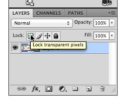
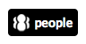

The User Interface Options component allows users to easily transform pages into one of several contrast versions. The
results of this transformation are much more complete if any logos, images, and other graphics are also converted to
match the contrast scheme.

If you are integrating UI Options into your site, we highly recommend you create contrast versions of your site logo,
and any other similarly static image. This page is divided into two sections:

1. Creating contrast versions of your graphics using Photoshop (or similar image editing software), and
2. Using CSS to switch between different contrast versions of the images.


## Converting Images With Transparency

UI Options provides four high contrast themes:

* yellow (`#FFFF00`) on black (`#000000`)
* white (`#FFFFFF`) on black (`#000000`)
* black (`#000000`) on yellow (`#FFFF00`)
* black (`#000000`) on white (`#FFFFFF`)
* light grey (`#BDBDBB`) on dark grey (`#555555`)

These themes would require different versions of images and graphics to match. To do this you will need to use image
editing software like Photoshop to change the colours of the images to match the different contrast themes.

The simplest images to convert are ones that already have a transparent background. Creating contrast versions involves
'locking' the transparent pixels so they stay transparent and then painting over everything not-transparent with the
desired colour.

## Creating Contrast Images in Photoshop

### Step 1 - Lock the transparent pixels

In Photoshop, you can lock the transparent pixels in one of at least two ways:

1. Type the '`/`' key, or
2. In the "Layers" panel, click the 'lock pixels button (see image below).



### Step 2 - Fill the rest of the image with the desired colour

In Photoshop, there are several ways to fill the image with a single colour:

1. Type `Alt + Delete` on Mac, or `Alt + Backspace` on Windows to fill the image with the current foreground colour, or
2. Type `Command + Delete` on Mac, or `Command + Backspace` on Windows to fill the image with the current background
   colour, or
3. Choose a paintbrush and a foreground colour, and drag the cursor over the image.

### Step 3 - Save the image for the web

* On Mac: Type `Shift + Alt + Command + S`
* On Windows: Type `Shift + Alt + Ctrl + S`

### Inverting Colours for Quick Black-White and White-Black Images

If you've created a black (or white) image, you can invert the colour to convert it to white (or black) by typing
`Command + I` on Mac, or `Ctrl + I` on Windows.

## Using CSS to Switch Web Graphics for Contrast Modes

While web images and graphics are typically implemented using `` tags, using background images instead makes it
very simple to substitute a different version of the image when a high contrast theme is used.

### When to Use Background Images and `` Tags

Images on web pages are often implemented by using `` tags. However, the `background` CSS property for images may
be advantageous.

To help decide whether to use an `` element or a background image, a good rule of thumb would be to use:

* `` tags if the graphic is important as content (i.e. a graph, photo, or a diagram).
* CSS `background` property for graphics that are cosmetic in nature, such as icons and logos.

The advantage of using `background` is that assistive technologies (like screen readers) will ignore them since it is
considered as cosmetic. This allows you to declutter and simplify the user experience by not having extraneous content.

<div class="infusion-docs-note">
    <strong>Note:</strong> UI Options changes the presentation of content by using CSS. Therefore images implemented
    with <code>&lt;img&gt;</code> HTML elements are not easily modified using CSS. It is possible to achieve a similar
    contrast effect by using <a href="https://developer.mozilla.org/en/docs/Web/CSS/filter">CSS filters</a>, but the
    results may not match the contrast mode.
</div>

### Example Contrast Image Switching

The following example shows how CSS can be used to switch background images with contrast versions.

HTML:

```html
<a class="site-logo" title="Example Company" href="http://www.example.com">
    Example Company
</a>
```

CSS:

```css
.site-logo {
    background-image: url("images/logo.png");
    background-repeat: no-repeat;
}

/* white logo for white-on-black theme */
.fl-theme-wb .site-logo {
    background-image: url("images/logo-white.png");
    color: #fff;
}

/* yellow logo for yellow-on-black theme */
.fl-theme-yb .site-logo {
    background-image: url("images/logo-yellow.png");
    color: #ff0;
}

/* black logo for black-on-white and black-on-yellow themes */
.fl-theme-bw .site-logo,
.fl-theme-by .site-logo {
    background-image: url("images/logo-black.png");
    color: #000;
}

/* light grey logo for light grey and dark grey theme */
.fl-theme-lgdg .site-logo {
    background-image: url("images/logo-grey.png");
    color: #bdbdbb;
}
```

The logo in the above example is implemented as a background image on a link to the site's home page. The contrast
images are substituted by using the same selector (i.e. `.site-logo`) prefaced with the theme class (i.e.
`.fl-theme-wb`), and specifying only the new image file. All other styles remain the same.

When a user selects a contrast theme using UI Options, the theme class will be added to the `<body>` of the document and
the high contrast logo will automatically be loaded.

It's worth noting that the images are implemented using a transparent background so that a single logo can be used for
different contrast themes. For example, a black logo on a transparent background can be used for both the black-on-white
theme and the black-on-yellow theme.

### Another Example of Contrast Image Switching

The following example shows how icons on navigation links can be changed to contrast versions. The approach here is like
the previous example.

### HTML

```html
<nav>
  <ul>
    <li><a href="about" class="about">About</a></li>
    <li><a href="people" class="people currentPage">People</a></li>
    <li><a href="news" class="news">News</a></li>
  </ul>
</nav>
```

```css
.people.currentPage {
    background-color: #0076b0;
    background-image: url("images/people-white.png");
    background-position: 0.3em 50%;
    background-repeat: no-repeat;
    background-size: auto 75%;
    color: #fff;
    padding-left: 2em;
}

.fl-theme-by .people.currentPage {
    background-image: url("images/people-yellow.png");
}

.fl-theme-yb .idi-people.currentPage,
.fl-theme-wb .idi-people.currentPage {
    background-image: url("images/people-black.png");
}

.fl-theme-lgdg .idi-people.currentPage {
    background-image: url("images/people-grey.png");
}
```

In this example, the 'current page' tab has an inverted colour scheme. The default colour would appear as shown in the
following image:


The high contrast version of the theme inverts the colour, so in the "black-on-white" theme, for example, the graphic
itself should appear white-on-black to keep with the original inverted style:

