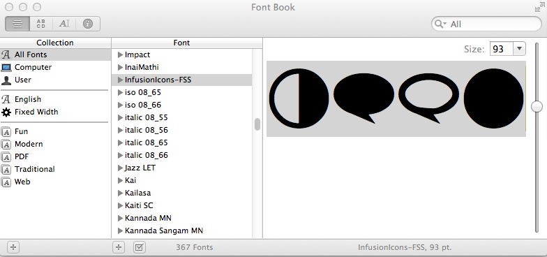

Using a font to render an icon has several advantages over the traditional method of using an image. This tutorial will
explain how to create Font Icons.

Some of the advantages of icons include:

* Scalable - works nicely regardless of client's magnification or view device DPI;
* Can change the colour with CSS;
* Can do everything traditional icons can (e.g. change opacity, rotation, etc.);
* Can add strokes, gradients, shadows, and etc.;
* Convert to text (with ligatures);
* Ligatures are read by screen readers;
* Changing icons to fonts is as simple as changing the font-family in CSS.

However, there are some shortcomings to keep in mind:

* Icon fonts are generally mono tone in colour.
* IE8 and IE9 do not support ligatures.
* Globally changing fonts will cause the text vs the icon to show.
* In situations where there is existing text accompanying an icon, specific markup containers need to be created for the
  icon.
* Modifying icon fonts is as involved as generated a new icon graphic in the "traditional" way - there is no real time
  saved in that regard.

## Procedure Summary

* Create the icon and save it as an SVG graphic.
* Use [IcoMoon](http://icomoon.io/) to generate a font from an SVG graphic.
* Add the font to your markup. Example:

```css
@font-face {
    font-family: 'CustomIcons';
    src: url('../fonts/CustomIcons.ttf'),
         url('../fonts/CustomIcons.eot');
}

a.myLink-icon {
    font-family: 'CustomIcons';
}

a.myLink-icon:before {
    content: "\e000"; /* The custom Unicode (aka. PUA) for the icon you want. */
    color: #ED3820;   /* Custom colour. */
}
```

## Step 1. Creating an SVG Symbol

Use illustration software to create an SVG version of the icon you want to use as a font.

Tips:

* The dimensions of the graphic doesn't matter since everything will be scaled by the browser's font-rendering.
* Work in binary (i.e. black and white) and do not apply effects such as drop-shadows or embossing.
* Sometimes the font conversion of the SVG may not work properly, so be prepared to edit your SVG file again.
* Overlapping regions of shapes may cause a subtraction when converted in IcoMoon (i.e. it will render as transparent) -
  in this case you may need to build a single shape from these conflicting shapes, or ensure none of your shapes overlap.

Download Example SVG file: [pencil-icon-01.svg](../../images/pencil-icon-01.svg)

## Step 2. Using IcoMoon to Generate Font

Steps:

1. Go to [IcoMoon](http://icomoon.io/app) (you can also run IcoMoon in "offline" mode in Chrome browser by installing
   the [IcoMoon Chrome app](http://goo.gl/we6ra))
2. Import your SVG icon - select "Import Icons" and choose your SVG file.
3. Select your icon from the list (should appear under "Your Custom Icons" section, and select the "Font ->" button at
   the bottom of the screen.
4. Save the ZIP file to a known location.
    * Note: selecting the "Preferences" button will give you options to name your CSS classes and files. It i
      recommended you use identifiers
5. Extract the contents of the ZIP file.
    * The files we are most interested in are the `./fonts/*.eot`, `./fonts/*.ttf`, and the `./index.html` files.
6. To verify that the font looks proper, open the `./index.html` file in a web browser. If the icon doesn't look right,
   you may need to edit the SVG file and repeat the font generation process.

## Step 3. Working with CSS and HTML

Once you are satisfied with the appearance of your font, it is time to add it to your HTML and CSS markup.

First, add or identify an element in your HTML markup for the new icon.

For example you have the following existing HTML and CSS:

```html
/* Existing HTML markup before adding new icon font. */
<a href="contact.html" id="contact_form">Contact us</a> /*this where the new font icon will go */
```

```css
/* Existing CSS markup for the HTML before adding new icon font. */
#contact_form {
    background: url("../images/envelope.png"); /*existing image that will be replaced by icon */
}
```

Next, add the new font to the CSS markup.

```css
@font-face {
    font-family: 'CustomIcons';                /*Specify the new font */
    src: url('../fonts/CustomIcons.eot?#iefix') format('embedded-opentype'), /* IE8 fix. */
         url('../fonts/CustomIcons.ttf'),
         url('../fonts/CustomIcons.eot');
}

#contact_form {
    background: url("../images/envelope.png"); /*existing image that will be replaced by icon */
    font-family: 'CustomIcons';                /*the new font icon */
}
```

Finally, add the new icon into the BEFORE pseudo class and delete any references to the old icon image.

```css
@font-face {
    font-family: 'CustomIcons';                /*Specify the new font */
    src: url('../fonts/CustomIcons.eot?#iefix') format('embedded-opentype'), /* IE8 fix. */
         url('../fonts/CustomIcons.ttf'),
         url('../fonts/CustomIcons.eot');
}

#contact_form {
    /* old icon image has been removed. */
    font-family: 'CustomIcons';                /*the new font icon */
}

#contact_form:before {
    content: "\e000";                          /*the custom Unicode (aka. PUA) for the icon.*/
}
```

This is all that is needed to add the new icon to your markup. You will notice there is a line specific to IE8 - for
more information on this, please see
[http://www.fontspring.com/blog/the-new-bulletproof-font-face-syntax](http://www.fontspring.com/blog/the-new-bulletproof-font-face-syntax).

## Unicode for font

_The Unicode (or "PUA code") for the custom font can be found in the HTML and CSS file generated by Ico Moon. If the
HTML and CSS files are unavailable, you can retrieve the Unicode using one of the methods listed under the section
"[Dealing with the TTF Unicode](HowToCreateAndUseFontIcons.md#dealing-with-the-ttf-unicode)" below._

**However, there is a problem** - the new icon font will replace the existing font of its container and all child
*elements and therefore removing any font styling you may have wanted to preserve. The next section will outline common
*issues and how to fix them and some best practices.

## Common Issues

### Preserving Existing Fonts

In the example above, the new custom icon font was added to an element that has existing text which causes a problem -
any other existing custom font will be overwritten within that container.

To illustrate this problem, assume Comic Sans is the font applied to the `<body>` element of our example, and an icon
font added to the `<a>` anchor within the `<body>`. Comic Sans will appear throughout the document except for the
contents within the `<a>`, which means "Contact us" will no longer be Comic Sans.

```html
<body>
    /* "Contact Us" should be in comic sans  */
    <a href="contact.html" id="contact_form">Contact us</a>
</body>
```

```css
@font-face {
    font-family: 'CustomIcons';
    src: url('../fonts/CustomIcons.ttf'),
         url('../fonts/CustomIcons.eot');
}

body {
    font-family: 'Comic Sans MS';
}

#contact_form {
    font-family: 'CustomIcons';
}

#contact_form:before {
    content: "\e000";
}
```

To overcome this issue, a new separate element should be created in the HTML for the icon font with no other content
contained within. The CSS file is then updated to reference this new markup structure.

```html
<body>
    /* "Contact Us" should be in comic sans */
    <span id="#icon-envelope"></span><a href="contact.html" id="contact_form">Contact us</a>
</body>
```

```css
@font-face {
    font-family: 'CustomIcons';
    src: url('../fonts/CustomIcons.ttf'),
         url('../fonts/CustomIcons.eot');
}

body {
    font-family: 'Comic Sans MS';
}

#icon-envelope {
    font-family: 'CustomIcons';
}

#icon-envelope:before {
    content: "\e000";
}
```

### Images and Labels

It's common for images to be used in functional ways such as acting as a button within an anchor tag. For example:

```html
<a href="download.html></a>
```

The problem here is if we replace the image in the anchor with an icon font, any text descriptions (the alt text) will
be removed as well - causing a possible usability and accessibility issue.

```html
/* The alt text is now gone, causing a usability and accessibility problem. */
<a href="download.html"></a>
```

```css
@font-face {
    font-family: 'CustomIcons';
    src: url('../fonts/CustomIcons.ttf'),
         url('../fonts/CustomIcons.eot');
}

a {
    font-family: 'CustomIcons';
}
a:before {
    content: "\e001";
}
```

To bring back some semantics and to help improve accessibility, we use "aria-label" to describe the functionality.

```html
/* Aria-label takes the place of alt text. */
<a href="download.html" aria-label="Download our latest stuff!"></a>
```

### Cross-Browser Oddities

Icon fonts can appear different across browsers and across operating systems. For example, the following icon is
rendered differently in Firefox in Mac OS X and in Windows despite being the same icon and the same browser.


To avoid these rendering problems, when creating the SVG images avoid using fine details - not only does this help
eliminate details in the icon font being lost during rendering, it also helps improve usability through clearer icons.

### IE8 Compatibility

To ensure custom fonts get rendered properly in Internet Explorer 8, you will need to add `?#iefix')
format('embedded-opentype')` to your CSS. For example:

```css
@font-face {
    font-family: 'CustomIcons';                /*Specify the new font */
    src: url('../fonts/CustomIcons.eot?#iefix') format('embedded-opentype'), /* IE8 fix. */
         url('../fonts/CustomIcons.ttf'),
         url('../fonts/CustomIcons.eot');
}
```

The IE8 fix needs to be the first URL in the list of sources otherwise the font will not appear.

Reference: [http://www.fontspring.com/blog/the-new-bulletproof-font-face-syntax](http://www.fontspring.com/blog/the-new-bulletproof-font-face-syntax)

### Dealing with the TTF Unicode

Ico Moon conveniently generates an HTML and CSS file for custom fonts which contain the Unicode to be used in your
markup. However, in the scenario the original CSS or HTML files are unavailable, here are two ways to obtain the Unicode
on Windows and Mac OS X 10.6+.

#### Obtaining Unicode in Windows

1. Install the custom TTF font to the OS (usually a right-click then select "Install" from the context menu).
2. Run Character Map (done by searching the Start menu, or by typing Win+R then "charmap").
3. Select the custom font from the Font drop-down menu. The glyphs in the custom font should now appear in the window.
4. Select a character in the window. The Unicode will appear in the bottom-left corner in the status bar.


#### Obtaining Unicode in Mac OS X 10.6 or Later

1. Enable Special Characters support as documented in this Apple Knowledge Base article:
   [OS X Lion: Enter special characters and symbols](http://support.apple.com/kb/ph3871)
2. Install the custom TTF font to the OS (usually double-click, then "Install").
3. Launch the Font Book application.
4. Also launch the Notes application.
5. In Font Book, locate the custom font under Collection > All Fonts. Select it. The custom font should now appear in
   the window.
6. In Font Book, select / highlight the characters from the custom font. Select Copy (Command+C or right-click -> Copy).
7. In Notes, Paste the text (Command+V or right-click -> Paste). The custom font should appear in Notepad.
8. In Notes, select the pasted text. Then open the "Edit" menu an select "Special Characters".
9. Now a "Characters" window appears with "Search" results containing each character selected in the previous step.
10. Select an icon in the "Character" panel. The Unicode will appear in the right column.



Above: An image showing the Mac OS X Font Book application with the custom characters highlighted.


Above: An image showing the Mac OS X Characters window. The Unicode value for a custom character appears in the right
most column.
