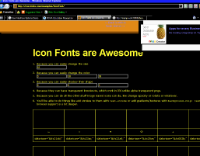
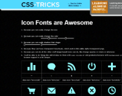
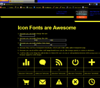
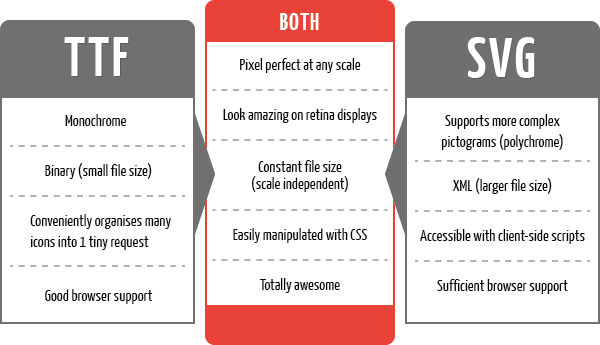
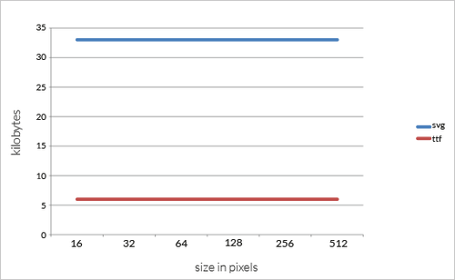
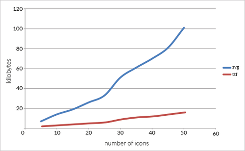

# Research of viability of using icon fonts in UI Options #

## Overview ##

JIRA: [FLUID-4934](http://issues.fluidproject.org/browse/FLUID-4934)

A proposal was put forward and accepted.
[mailing list thread](http://lists.idrc.ocad.ca/pipermail/fluid-work/2013-April/009016.html)

**Proposal**

We should use font icons for relatively simple images that can be represented using a single colour, or a few colours in cases where stacking is appropriate, and which need to be responsive to resolution, size, and colour changes on the fly.

For complex images, or those that do not require the responsiveness listed above, we should make use of either svg or raster images as appropriate.

**Guideline for using Font Icons**

* Use PUA font icons
* Provide a text alternatives for non-presentational uses
* Add through CSS using classes
* Apply the class to add the font icon to an element that will only contain the font icon
    * e.g.  font icon  where "font icon" would be the actual font icon displayed.

## Why use icons ##
### Reasons to use icons: ###

* icons are easily recognizable
* icons can cross language boundaries
* people can remember and find images more easily than words
* people can discriminate between distinctive icons more easily than between words
* icons assist non-literate, semi-literate users and "voluntarily illiterate" users
* people like pictures
* icons often take up less space than equivalent text

### Reasons not to use icons: ###

* images are ambiguous and have no universally accepted syntax
* icons must be learned
* abstract concepts are difficult to represent as icons
* images are often culturally-specific or culturally unacceptable
* people make more mistakes interpreting icons than they do interpreting text buttons, or icons with text labels
* icons must be designed as icons, not simply as pictures, or they do not work

## Why use Icon Fonts ##
### Pros ###

* Scalable ( size and hi-dpi screens )
* Can change the colour with css
* Can do everything traditional icons can (e.g. change opacity, rotation, etc.)
* Can add strokes, gradients, shadows, and etc.
* Convert to text (with ligatures)
* Ligatures are read by screen readers
* Changing icons to fonts is as simple as changing the font

### Cons ###

* Mono tone
* IE8 and IE9 do not support ligatures
* Globally changing fonts will cause the text vs the icon to show
* Adding or modifying fonts is not trivial - first font needs to be edited, generated, and then CSS needs to be updated.

## To investigate ##

* can we use other languages (I18n) and phrases in the metadata
* learn more about what 'private use area' (PUA) is and how to use it
* prevent font-icons from being read when they are purely presentational
* may only be an issue when we are using it on elements like labels that are typically always read.
* investigate work around for IE 8 and 9 support

## Research ##

### learn more about what 'private use area' (PUA) is and how to use it: ###

_Private use area (PUA)_ is intentionally left behind for third parties to define their own characters without conflicting with the unicode.
Can we use other languages (I18n) and phrases in the metadata:

The tool that we are using at this point ([Icomoon](http://icomoon.io/)) is not allowing us to enter other languages in the metadata. We have not fund a free tool other than Icomoon that would allow us to edit the metadata. But there are applications like [FontLab Studio](http://www.fontlab.com/font-editor/fontlab-studio/) ($650) that would allow us to create and edit ligatures in different languages.

### Mono-tone vs. Dual-tone ###

* Going through and researching our findings on dual-tone icons, they don’t appear to have many advantages over single-tone icons. They could add depth to the icon, but could takeaway from its contrast and simplicity of monotone icons

* They are not “dual-color” icons and cannot have two different colors. The lighter tone is just a lower gradient of the original color. So, for example, if the color chosen for the icon were green, the “lighter tone” would be the same green in a lighter gradient. This option would not be useful for creating many web elements.

* There are methods to create a gradient effect with mono-tone icons. 

### Browser Support ###

#### IE8 ####

* IE8 has a [known bug](http://andymcfee.com/2012/04/04/icon-fonts-pseudo-elements-and-ie8/) where if the mouse cursor is located outside the content area when the browser is refreshed, the default font will be displayed (i.e. a box is shown instead of the icon).

1. To test, load in IE8 [http://css-tricks.com/examples/IconFont/](http://css-tricks.com/examples/IconFont/)
2. Move mouse pointer into the chrome area or outside the IE8 window
3. Refresh the browser
4. Notice the icons change to empty squares.

* CSS-tricks implementation renders properly assuming mouse pointer is properly positioned in the content area.
* NVDA does not read out ligature for font.

* In Windows high contrast mode, font icons rendered as background images appear blank. See below for more details.

#### IE9 ####

* using the implementation on the [CSS-tricks font page](http://css-tricks.com/examples/IconFont/).
* Renders fine.
* IE8 refresh bug, as mentioned above, is not a problem.
* NVDA testing still to be done. IE9 to be tested.

#### High Contrast Mode in Windows ####

* tested in Windows 7
* Changed Windows 7 appearance to yellow on black contrast mode (Right click desktop > Appearance > Change theme to contrast theme)
* loaded [CSS-tricks font page](http://css-tricks.com/examples/IconFont/).
* IE8 - Background images disappear

* IE9 - Background images appear

* Chrome - Detects OS is in contrast mode and offers a download for a 3rd party browser extension that applies contrast theme. Renders background font as cyan on black.

* FF - Applies the system contrast theme and renders background images properly.

### Size limitations ###

Each letter is usually less than 1KB in a font, but icons are a bit heavier because they have more vectors, and usually are less than 5KB. With the tools that we are using at the moment, we can make many graphics into icons. But every icon should have a limit, because they could have a huge impact on page load time. **Icons should not be more than 10 kb for each letter.**

Another thing to consider is size of the font file. Font files are usually around 100KB and big fonts with different styles don't exceed 2MB.

### Accessibility of Font Icons ###

_Presentational_: Icons are used strictly for visual interest and hold no meaning.

* The use of font-icons seems to be cutting-edge and no real solution exists to hide the icon content specifically from screenreaders
* aria-hidden not appropriate for hiding visual elements from AT
    * AT is more than screenreaders (ex. magnifier) and we don't necessarily want to hide from all of them, yet no way to specify screenreaders-only
    * Misuse of the intention of the tag. The "MAY" clause in ARIA's aria-hidden documentation that says sometimes it's okay to use on visual elements is controversial and may be removed
* Perhaps there's a setting for screenreaders that allows a user to skip over unicode gibberish? Check/test. Note that text added via CSS through "content:" IS added to the accessibility tree for AT.
* Regarding using an image with role="presentation" vs. a font icon, there is no obvious winner in terms of accessibility. For screenreaders, images work best as they would be skippable, but for visual users, the icon fonts are rendered much better and are easily scaled.
* If we use font-icons, we should properly document their behaviour with screenreaders.

See more: [http://issues.fluidproject.org/browse/FLUID-4934](http://issues.fluidproject.org/browse/FLUID-4934)

_Not Presentational_: Icons are meaningful in that they represent useful information and/or are functional elements.

* How meaningful is a ligature?
    * In some cases the presence of a ligature might not be informative enough. For example, the arrow above the contrast themes shows which theme is selected. It has the ligature "indicator" which does not seem descriptive enough. "Current theme" might be preferable, but spaces within ligatures are not permitted. Is there a way to embellish or semantically replace ligature/unicode with something more meaningful? Ex. I wonder if aria-label or labelledby would be effective/appropriate here.
    * In other cases a simple ligature might be enough, like with a "next" arrow.

[Source](http://edmac.usask.ca/rick/vdim/Icons/3ProCon/ProCon.htm)

## Testing ##

###Icon font obstacle course ###

[Obstacle course](https://dl.dropboxusercontent.com/u/548929/fontIconTests/fontIconTest-functional.html)

[Results](https://docs.google.com/spreadsheet/ccc?key=0Aho0Mmb7rzeydEJRX3p3anJKVzJaeEpfd0swbjFyTWc&usp=sharing)

* Create a simple test environment (obstacle course)
* Test screen reader navigation and how it reads them
* Consider all current use cases for icon fonts (e.g. video player controls: hover styles, active vs inactive, etc) and how we'd used the fonts there, to identify obstacles for the course

* Requirements
    * cases where ligature should be read
    * cases where ligatures shouldn't be read, but visually displayed (presentation only)
    * font-icons in various landmarks (e.g. links, headers, etc.)
    * change the page language to see if it affects the font-icons ( maybe have different elements with different language types )
    * adjust styling of font-icons to indicate focus, hover effects
        * could be shadow, glow, colour, background colour, etc.
        * change icons

### Icon Fonts vs SVG Icons ###

[svg test page](https://dl.dropboxusercontent.com/u/548929/fontIconTests/svgTest.html)

#### Using SVG (Scalable Vector Graphics) ####

[how to use svg](http://css-tricks.com/using-svg/)

* svg img / background-image
    * pros
        * scalable
        * svg files can be cached
    * cons
        * can't change inner values e.g. fill colour
* &lt;svg>
    * pros
        * scalable
        * can modify inner values with css
    * cons
        * won't be cached
        * need to use svg markup to add
* &lt;embed> or &lt;object>
    * pros
        * scalable
        * markup pulled in
    * cons
        * works like an iframe, svg markup is a separate document.
            * would have to use js to inject styling changes
        * renders slower

#### SVG vs. Font Icons ####

**Feature breakdown**

**File size as scale increases**

**File size as number of Icons increases**

[source](http://blog.pictonic.co/post/32869817328/svgs-are-cool-but-icon-fonts-are-just-10-of-their)

[**Browser support for simple SVG Functionality**](http://caniuse.com/#feat=svg)

**styling**

Not sure it will be possible to change from one image to another using just css (unless used as a background-image).

CSS properties for styling internals: [http://www.w3.org/TR/SVG/styling.html](http://www.w3.org/TR/SVG/styling.html)

#### What are the download file size implications of representing "the same" icon as a SVG or font icon size? ####

Fonts are much smaller in terms of file size. If you look at the [obstacle course](https://dl.dropboxusercontent.com/u/548929/fontIconTests/fontIconTest-functional.html), the [ttf](../images/icomoon.ttf) is 4KB vs 13KB for the [svg](../images/icomoon.svg) file. ( See also: [Blog Post from Pictonic](http://blog.pictonic.co/post/32869817328/svgs-are-cool-but-icon-fonts-are-just-10-of-their))

#### embeddability/stackability - is it as easy to composite multiple different "icons" as SVG or font icons (as per Johnny's link for "icon stacks") ####

Stacking via css positioning seems to work.

[icon stacks](http://conor.cc/2013/03/icon-stacks/)

[http://conor.cc/2013/03/textured-icons-with-icon-stacks/](http://conor.cc/2013/03/textured-icons-with-icon-stacks/)

####How does the use of SVG interact with ATs - are the special issues relating to focus, announcement by a screenreader, etc? ####

&lt;img> svgs behave like regular images, so adding alt text worked. The other types (&lt;svg>, &lt;embed>, &lt;object>) were ignored by NVDA and VoiceOver. However, if you set a role="img" and provide a text alternative like aria-labelledby, the screen reader will read it out.

(see: [stackoverflow](http://stackoverflow.com/questions/4697100/accessibility-recommended-alt-text-convention-for-svg-and-mathml))

#### Performance implications, especially on mobile devices - these are sensitive both to download costs as well as CPU costs during rendering - are either or both approaches viable on a low-capability smartphone? ####

Running from the desktop, the &lt;embed> and &lt;object> methods for inserting svg's lag. This is probably because it is creating another document within the page.

Here is a summary of SVG support in mobile browsers: [http://caniuse.com/#agents=mobile&cats=SVG](http://caniuse.com/#agents=mobile&cats=SVG)

Salient points

* Android devices older than v3.0 do not support SVG as an &lt;object> or &lt;embed>.
* SVG used in an IMG tag is partially supported in mobile Safari 3.2
* Most modern mobile browsers support "basic" SVG via object, img, or svg tags (exception being Opera Mini which does not support SVG elements).
* SVG filters (i.e. blurs and shadows) and SMIL animation are spotty across all browsers.

#### Visual fidelity - does a page containing SVG elements appear "solid" as it is zoomed, or does the SVG content appear to "lag" the main page in rendering? ####

I haven't experienced any lag, but have only used simple icons. Tried on Mac OS 10.8, iPad 2 iOS 5.1.1, iPhone 4 iOS 6.1.3, iPhone 3Gs iOS 4.0.
(Note that not all types of svg inputs were supported across devices).

FF 20 (Win 7) did have some issues with scaling the &lt;img> svg's. At times it would be blurry, but this appeared seemingly randomly.
